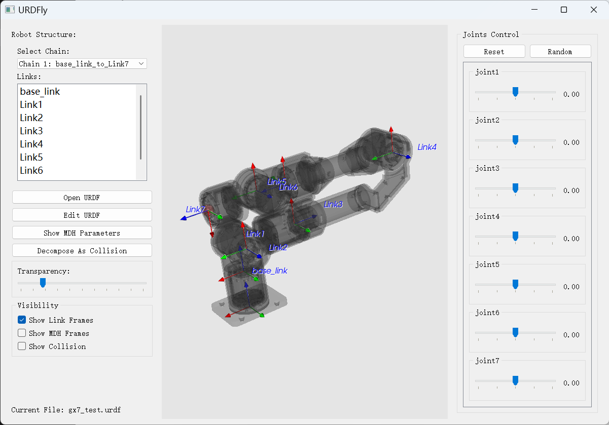
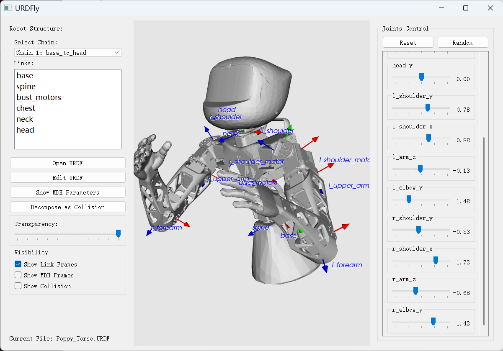
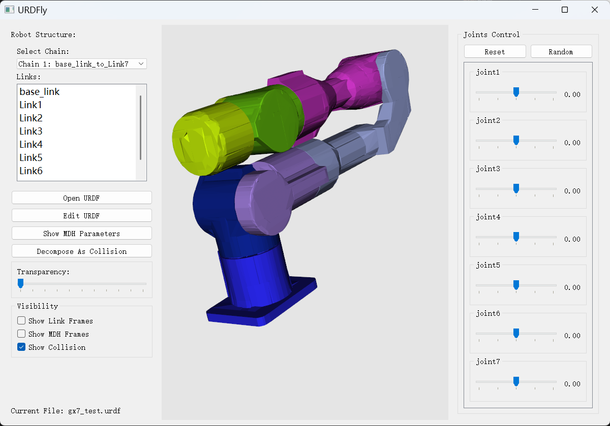
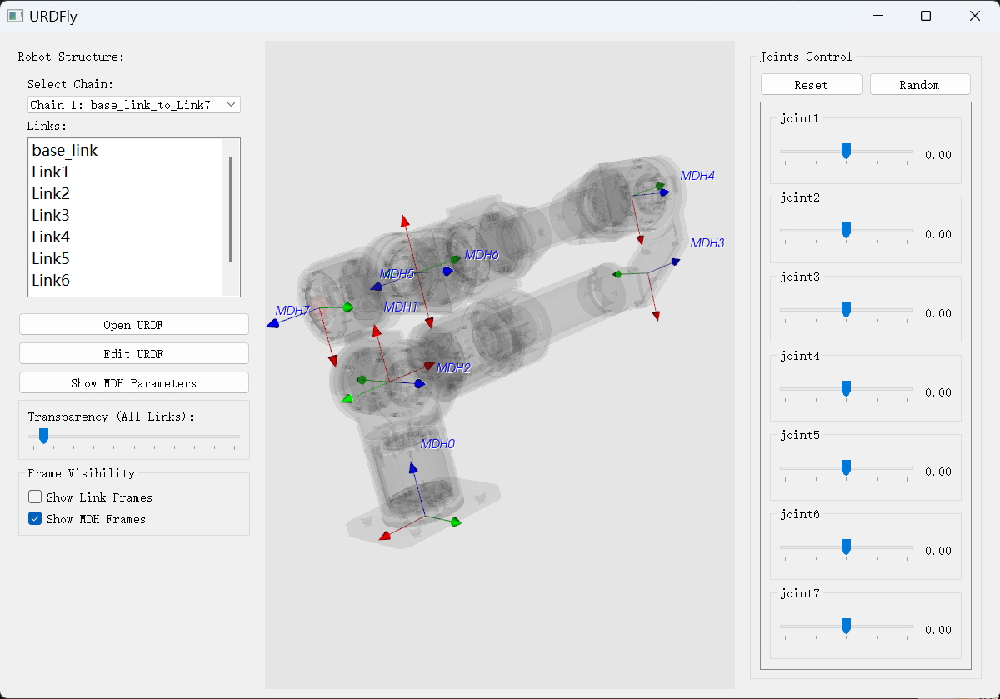
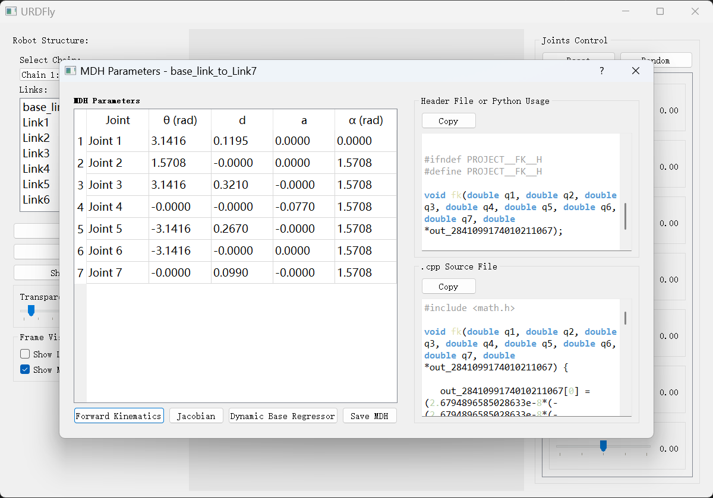
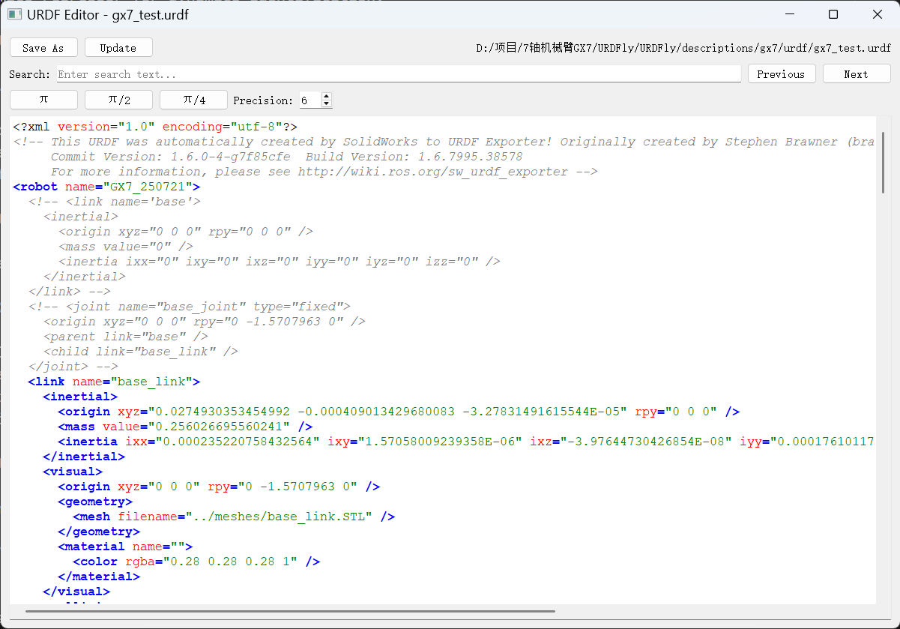
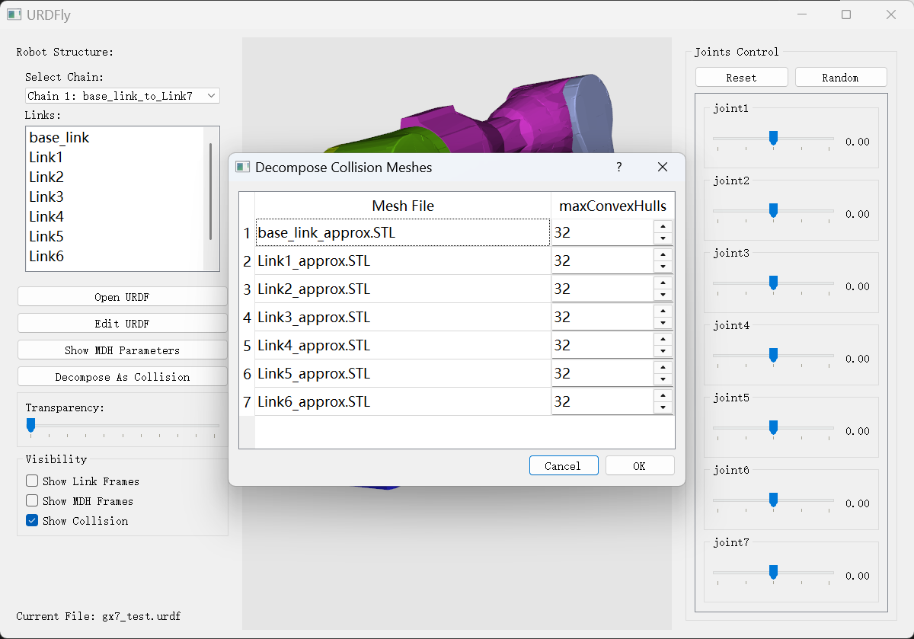

# URDFly




## Overview

URDFly is a Python-based toolkit for working with URDF (Unified Robot Description Format) files, specifically designed for robotic arm modeling, simulation, and control. The project provides tools for parsing, visualizing, and analyzing robotic systems defined in URDF format, with a focus on axes visulazation, urdf editing, MDH parameter conversion, kinematics calculation, and dynamics regressor codegen.

## Features

- URDF file parsing and manipulation
- 3D visualization of robot models
- Dynamic regressor generation using symbolic computation
- Modified Denavit-Hartenberg (MDH) parameter conversion

## Highlight

### URDF Visualization

- Support `stl` and `obj` mesh file format
- Support transparent mesh and multiple axes visualization
- Support highligt link by clicking the Links list.
- Support original link axes visualization and M-DH axes visualization
- Support virtual link visualization by a read sphere.
- Support collision mesh visualization



### MDH Parameter Conversion

The project includes a tool for converting URDF to Modified DH (MDH) parameters. Multi chain robot is supported.



The MDH can be used to calculate the forward kinematics of the robot and generate dynamics regressor (this takes a while) for dynamics identification.



### URDF Editing and Visualization

The project includes a editor for URDF file. Clicking the `Edit URDF` button can open the editor. Clincking the `update` button will update the visulazation from the modified urdf. The editor provides searching and autofill of different `pi` with adjustable precision.



### Convex Decomposition

URDFly provides a utility to decompose collision meshes into convex shapes, which can be useful for physics simulations and collision detection. Clicking the `Decompose As Collision` button and editing the `maxConvexHulls` parameter can decompose the collision mesh into a specified number of convex hulls.



After clicking `ok` (this will take a while to do the convex decomposition) the URDF editor will pop up and clicking `update` button will update the visulazation from the modified urdf.

## Installation

### Prerequisites

- Python 3.8+
- Required Python packages (install via pip):

  ```
  pip install numpy sympy pyqt5 vtk anytree transformations
  ```

## Usage

```
python main.py
```

## Project Structure

- `main.py`: Main entry point for the application
- `urdf_parser.py`: URDF file parsing utilities
- `urdf_vtk_model.py`: VTK-based visualization for URDF models
- `mdh_dialog.py`: Tools for Modified Denavit-Hartenberg parameter conversion
- `xml_editor.py`: Utilities for editing URDF XML files
- `codegen/`: Code generation for kinematics and dynamics
  - `forward_kinematics.py`: Forward kinematics calculation
  - `dynamic_base_regressor.py`: Dynamic parameter regression
  - `sympybotics/`: Symbolic robotics computation library
- `descriptions/`: Robot model descriptions
  - `gx7/`: GX7 7-axis robot arm model
  - `poppy/`: Poppy humanoid robot model
- `docs/`: Documentation files
- `third_parties/`: Third-party utilities and helpers

## Documentation

For more detailed information, please refer to the documentation in the `docs/` directory:

- [MDH Parameters Tutorial](docs/MDH_Parameters_Tutorial.md)

## Contributing

Contributions are welcome! Please feel free to submit a Pull Request.

## License

This project is licensed under the MIT License - see the LICENSE file for details.

## Acknowledgments

- [sympybotics](https://github.com/sympybotics/sympybotics)
- [urdf_to_dh] (<https://github.com/mcevoyandy/urdf_to_dh>)
